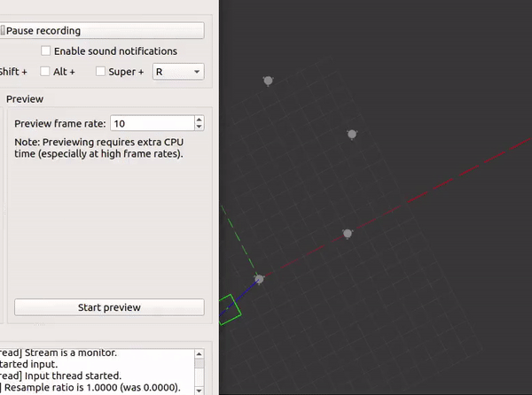

# Swarm_formation_control

This repo contains the code for Formation Control for multiple omni-directional robots. I've used PID for the go-to-goal algorithm and Optimal Reciprocal Control Algorithm (ORCA) for collision avoidance. The results are shown below. 




Due to the large computational requirement, I made changes to the algorithm to take a sub-optimal path in the 6 robot case. The optimization and computational requirements are the major drawback.

To build the repo place it in your workspace and do:
```
catkin_make source
devel/setup.bash
```

To run the algorithm do:

```
roslaunch omni_bot multibot.launch
rosrun omni_bot ORCA.py
```
